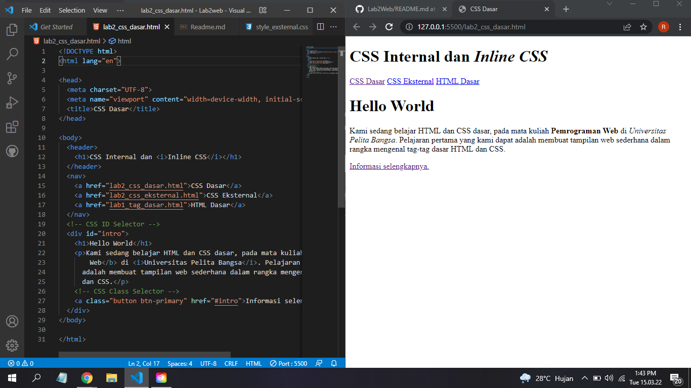
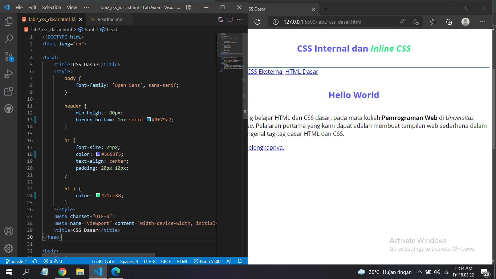
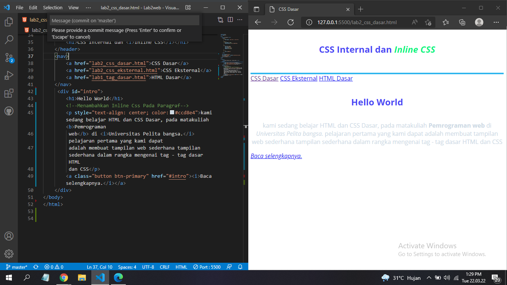
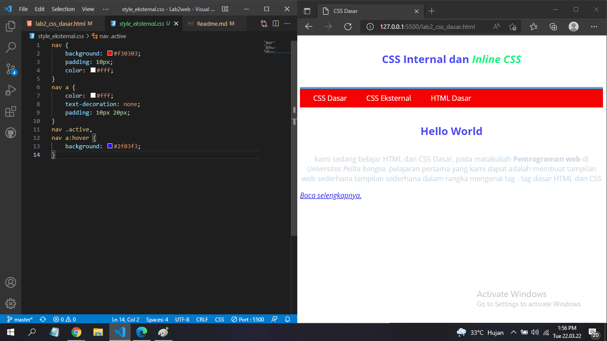
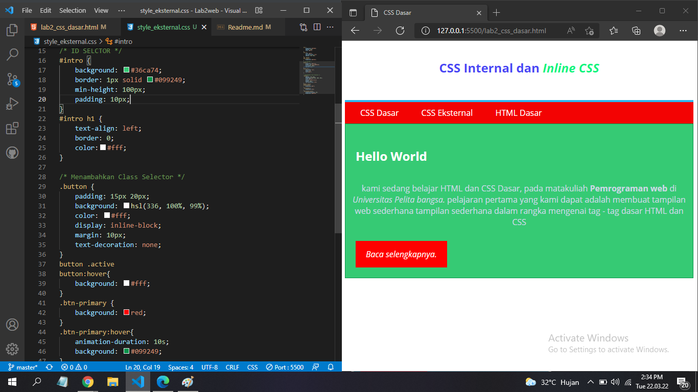
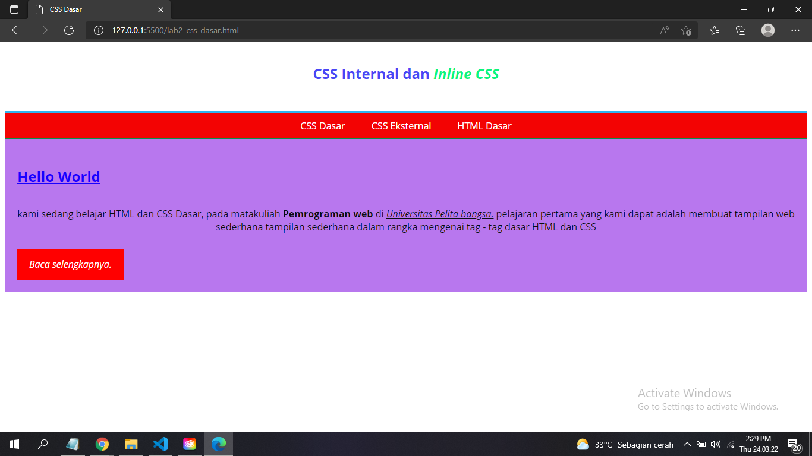
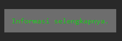
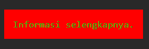
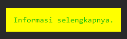
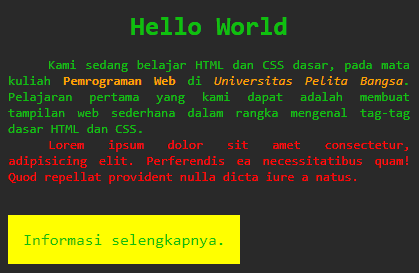

# Tugas Lab 2 Web
## Profil
| # | Biodata |
| -------- | --- |
| **Nama** | Rangga Saputra |
| **NIM** | 312010266 |
| **Kelas** | TI.20.A2 |
| **Mata Kuliah** | Pemrograman Web |

## Langkah 1
1. Membuat Dokumen HTML dengan nama `lab2_css_dasar.html`.

2. Lalu buat struktur dasar HTML.
```html
<!DOCTYPE html>
<html lang="en">

<head>
  <meta charset="UTF-8">
  <meta name="viewport" content="width=device-width, initial-scale=1.0">
  <title>CSS Dasar</title>
</head>

<body>
  <header>
    <h1>CSS Internal dan <i>Inline CSS</i></h1>
  </header>
  <nav>
    <a href="lab2_css_dasar.html">CSS Dasar</a>
    <a href="lab2_css_eksternal.html">CSS Eksternal</a>
    <a href="lab1_tag_dasar.html">HTML Dasar</a>
  </nav>
  <!-- CSS ID Selector -->
  <div id="intro">
    <h1>Hello World</h1>
    <p>Kami sedang belajar HTML dan CSS dasar, pada mata kuliah <b>Pemrograman
        Web</b> di <i>Universitas Pelita Bangsa</i>. Pelajaran pertama yang kami dapat
      adalah membuat tampilan web sederhana dalam rangka mengenal tag-tag dasar HTML
      dan CSS.</p>
    <!-- CSS Class Selector -->
    <a class="button btn-primary" href="#intro">Informasi selengkapnya.</a>
  </div>
</body>

</html>
```

* maka hasilnya akan seperti ini 


## Langkah 2 Mendeklarasikan CSS internal
* Tambahkan kode berikut ke dalam HTML
```css
<!-- CSS Internal -->
  <style>
     body {
            font-family: 'Open Sans', sans-serif;
        }

        header {
            min-height: 100px;
            border-bottom: 4px solid #2fb5ee;
        }

        h1 {
            font-size: 24px;
            color: #4946f5;
            text-align: center;
            padding: 20px 10px;
        }

        h1 i {
            color: #09f57f;
        }
  </style>
  ```
 * Maka hasilnya akan seperti berikut
 

 ## Menambahkan Inline CSS
 * Menambahkan Inline CSS Kemudian tambahkan deklarasi inline CSS pada tag
 ```
 <p style="text-align: center; color: cc8e4;>
 ```
 * Hasilnya akan seperti berikut
 

 ## 4. Membuat CSS Eksternal
* Membuat CSS Eksternal dengan membuat file baru dengan nama style_eksternal.css kemudian buat deklarasi css seperti berikut ini.
``` css
nav {
    background: #f30303;
    padding: 10px;
    color: #fff;
}
nav a {
    color: #fff;
    text-decoration: none;
    padding: 10px 20px;
}
nav .active,
nav a:hover {
    background: #2f03f3;
}
``` 

 * kemudian tambah tag `<link>` untuk merujuk file css yang sudah di buat pada bagian `<head>`

```
<head>
    <!--menyisipkan css eksternal-->
    <link rel="stylesheet" href="style_eksternal.css" type="text/css">
</head> 
``` 
* selanjutnya refresh kembali pada browser untuk melihat perubahan menjadi seperti ini


## 5. Menambahkan CSS Selector
* selanjutnya menambahkan CSS Selector menggunkan ID dan class Selector pada file style_eksternal.css dan menambahkan kode seperti berikut
```css
/* ID SELCTOR */
#intro {
    background: #36ca74;
    border: 1px solid #099249;
    min-height: 100px;
    padding: 10px;
}
#intro h1 {
    text-align: left;
    border: 0;
    color:#fff;
}

/* Menambahkan Class Selector */
.button {
    padding: 15px 20px;
    background: hsl(336, 100%, 99%);
    color: #fff;
    display: inline-block;
    margin: 10px;
    text-decoration: none;
}
button .active
button:hover{
    background: #fff;
}
.btn-primary {
    background: red;
}
.btn-primary:hover{
    animation-duration: 10s;
    background: #099249;
} 
```
* Maka hasilnya seperti berikut


## Pertanyaan
1. Lakukan eksperimen dengan mengubah dan menambah properti dan nilai pada kode CSS dengan mengacu pada CSS Cheat Sheet yang diberikan pada file terpisah dari modul ini.

> Saya melakukan banyak penambahan dan perubahan yang hasilnya kurang lebih jadi seperti berikut.


2. Apa perbedaan pendeklarasian CSS elemen `h1 {...}` dengan `#intro h1 {...}`? Berikan penjelasannya!

> Apabila mendeklarasikan `h1 {...}` saja maka semua tag `<h1>` akan terkena dampaknya.
> Apabila mendeklarasikan `#intro h1 {...}` maka akan lebih spesifik men-select semua tag `<h1>` yang ada didalam `#intro`.

3. Apabila ada deklarasi CSS secara internal, lalu ditambahkan CSS eksternal dan inline CSS pada elemen yang sama. Deklarasi manakah yang akan ditampilkan pada browser? Berikan penjelasan dan contohnya!

> Apabila mendeklarasikan css internal, eksternal, inline pada selector yang sama maka yang dijalankan/diprioritaskan itu yang inline. Karena menambahkan css inline itu lebih spesifik dibanding css lainnya.

Contoh saya fokus pada property background-color pada `a.button`:

* Saya mendeklarasikan CSS _Eksternal_ pada `.button`.



* Saya mendeklarasikan CSS _Internal_ pada `.button` menambahkan `background-color : red`.



* Saya mendeklarasikan CSS Inline pada tag `<a class="button">` menambahkan atribut `style="background-color : yellow"`.



4. Pada sebuah elemen HTML terdapat ID dan Class, apabila masing-masing selector tersebut terdapat deklarasi CSS, maka deklarasi manakah yang akan ditampilkan pada browser? Berikan penjelasan dan contohnya! `<p id="paragraf-1" class="text-paragraf">`
Tentu saja yang akan diprioritaskan itu ID.

Contoh saya menambahkan style pada element ini `<p id="paragraf-1" class="text-paragraf">`
```css
#paragraf-1 {
    color: red;
}

.text-paragraf {
    color: blue;
}
```
